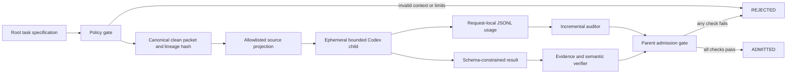
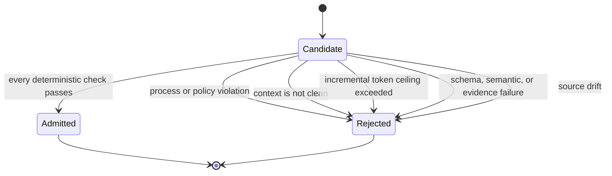

# Architecture

Agent Floor separates intent, enforcement, measurement, and adjudication. A policy declaration is not reported as a mechanical guarantee; telemetry is not reported as billing; a valid citation is not treated as a valid conclusion.



## Control classification

| Class | Examples | Authority |
|---|---|---|
| Policy controls | Allowlisted model, selected reasoning, maximum depth, concurrency, cycles, runtime, output, and incremental-token admission ceiling | Root task specification validated before execution |
| Mechanical controls | New ephemeral process, no resume path, clean packet, ignored inherited rules/configuration, read-only projection, disabled child fan-out, process lock, event monitor, timer | Runner and operating-system process boundary |
| Telemetry interpretation | Unique request usage, cached/fresh split, cumulative baseline, boundary delta, duplicate removal | Auditor over JSONL records |
| Semantic evidence admission | Allowed status and finding codes, required/forbidden terms, minimum evidence, exact file-line-excerpt verification, source hash | Parent gate after execution |

## Context boundary

The runner never forks or resumes a parent task. It starts `codex exec` as a new ephemeral process and sends one canonical packet through standard input. User configuration and project rules are ignored for the child. Project documentation is capped at zero bytes and replaced with a generated bounded instruction file.

The packet records:

- `context.mode: clean` and `inherited_turns: 0`;
- parent and child lineage;
- repository boundary and allowlisted authority;
- model and reasoning selection;
- depth, concurrency, cycle, runtime, output, and token-admission limits;
- source hashes and evidence requirements;
- final output schema;
- canonical packet SHA-256.

The packet is limited to 8 KiB. Full conversation history has no packet field and `fork_turns="all"` fails validation before a child process starts.

## Authority boundary

Only task-declared regular files whose resolved paths remain inside the repository boundary are accepted. Before execution, those files are copied into a temporary projection. Codex runs from that projection in a read-only sandbox. The original repository is not the child working directory.

Before admission, Agent Floor re-hashes the original sources and rejects drift. Each evidence item must:

1. use an allowlisted repository-relative path;
2. resolve inside the original boundary;
3. cite an existing one-based line;
4. supply an excerpt contained in that normalized line;
5. carry a non-empty claim.

The admitted evidence record hashes `path:line:normalized-line`, binding the decision to observed content.

## Delegation and resource boundary

The root-to-child depth is one. Inside the child process, multi-agent tools and fan-out are disabled and child `agents.max_depth` is zero. A repository-scoped cross-process lock enforces the declared concurrency ceiling. The event monitor counts model/tool cycles and terminates the process when the hard cycle, runtime, or output boundary is crossed.

The token limit is different: completed request usage is measured from the returned telemetry and checked before admission. It is not a provider-side preflight spending cap.

## Usage equations

For current `codex exec --json` traces:

```text
incremental_tokens = sum(turn.completed.usage.input_tokens
                       + turn.completed.usage.output_tokens)
fresh_input_tokens = input_tokens - cached_input_tokens
```

`reasoning_output_tokens` is reported separately but is not added again because it is a subset of output tokens.

For legacy rollout traces:

```text
incremental_tokens = sum(unique post-boundary last_token_usage.total_tokens)
cumulative_delta  = last cumulative total - pre-boundary cumulative total
verified          = incremental_tokens == cumulative_delta
```

A rollout without an explicit worker boundary is rejected. Exact duplicate token events are fingerprinted and removed. Cumulative totals remain diagnostic telemetry; they are never presented as request-local cost or account billing.

## Admission state machine



A worker's `recommendation` concerns the inspected target. It cannot admit or reject its own result. Parent-declared execution, usage, source-integrity, evidence, and semantic rules control admission.

## Artifact flow

| Artifact | Created by | Consumed by |
|---|---|---|
| Task specification | Root operator | Policy gate |
| Child packet | Packet builder | Runner and admission gate |
| Source projection | Runner | Child process |
| JSONL event stream | Codex child | Usage auditor |
| Worker output | Codex child | Admission gate |
| Admission record | Parent gate | Root task or later authorized phase |
| Evidence manifest | Release process | Public verifier |
