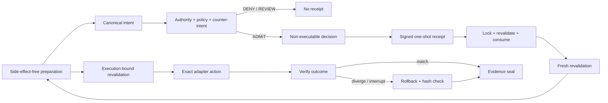

# CINT threat model

## 1. Overview

SI1 CINT is a local decision and execution runtime. It converts an explicit
request into a canonical intent, resolves current principal and authority state,
challenges policy and machine state, and returns `ADMIT`, `DENY`, or `REVIEW`.
Only `ADMIT` is eligible for a signed one-shot receipt, and only a currently
valid consumed receipt can reach an action adapter.

### Components and source

| Component | Security role | Source evidence |
|---|---|---|
| Canonical records | Execute all 13 public schemas; reject unknown fields, wrong protocols, and tampered digests | `src/cint/schema.js`, `src/cint/canonical.js` |
| Intent reconstruction | Bind request, action, target, context, effects, and uncertainty | `src/cint/intent.js:33-67` |
| Authority and policy | Enforce exact grants, epochs, validity, allowed adapters, and rollback policy | `src/cint/authority.js:24-110`, `src/cint/policy.js:12-97` |
| Counter-intent and decision | Deny silent or mismatched intent; route uncertainty; keep decisions non-executable | `src/cint/challenge.js:54-127`, `src/cint/decision.js:11-67` |
| Receipt authority | Authenticate eligible decision bindings and lifetime | `src/cint/receipt.js:22-119` |
| Receipt store | Register, lock, revalidate, consume once, and terminally reject | `src/cint/store.js:39-190` |
| Execution gate | Preflight verifiers, revalidate inside the lock, before preparation, and immediately after preparation before execution | `src/cint/execution.js` |
| Outcome, ledger, and seal | Verify or restore state; hash-chain and authenticate terminal evidence | `src/cint/outcome.js:3-31`, `src/cint/evidence.js:16-85`, `src/cint/seal.js:18-110` |
| Synthetic adapter | Confine a disposable patch and restore exact original bytes | `src/cint/adapters/synthetic-file-patch.js:34-125` |
| Codex Adapter 01 | Bind and execute the preserved read-only Agent Floor packet | `src/cint/adapters/codex/index.js:49-128` |

### Effective resources

| Deployment or workflow | Resource or capability | Configuration and precedence | Safe effective value or location | Readers, writers, or recipients | Enforcing control | Evidence or unknowns |
|---|---|---|---|---|---|---|
| Embedded CINT runtime | Receipt key | Constructor input owned by embedding process | Private in-memory field; never serialized | Receipt authority only | Minimum 32 bytes and HMAC-SHA256 | `src/cint/receipt.js:22-39`; external key storage and rotation are caller-owned |
| Embedded CINT runtime | Seal key | Constructor input owned by embedding process | Private in-memory field; never serialized | Seal authority only | Minimum 32 bytes and HMAC-SHA256 | `src/cint/seal.js:18-35`; external key storage and rotation are caller-owned |
| One-shot execution | Receipt state root | Caller supplies store root | Hashed filenames under pending, locks, consumed, rejected | CINT store process | Exclusive creation and terminal records | `src/cint/store.js:39-64`, `src/cint/store.js:107-190` |
| Evidence workflow | Ledger file | Caller supplies file path | Canonical local JSONL with adjacent exclusive lock | CINT execution gate | Digest chain, exclusive append, fsync | `src/cint/evidence.js:16-85`; retention is caller-owned |
| Synthetic proof | Writable target | Adapter root plus receipt-bound relative path | Existing regular file resolved inside disposable root | Synthetic adapter only | Containment, expected pre-hash, atomic write, verify, rollback | `src/cint/adapters/synthetic-file-patch.js:48-125` |
| Codex Adapter 01 | Source projection | Legacy spec allowlist | Temporary run-local copy | Ephemeral Codex child | Read-only sandbox and clean packet | `src/adapters/codex-delegation/runner.js:198-258`, `src/adapters/codex-delegation/runner.js:376-501` |
| Codex Adapter 01 | Run evidence directory | Adapter constructor input | Caller-selected local output directory | Legacy runner and local operator | Adapter task/packet digest plus CINT receipt | `src/cint/adapters/codex/index.js:49-103`; output retention and disclosure are caller-owned |

## 2. Threat Model, Trust Boundaries, and Assumptions

### Protected assets and objectives

- integrity of principal intent and its declared consequences;
- exclusivity, freshness, scope, and provenance of executable authority;
- policy and authority revocation effectiveness;
- integrity of target state before and after action;
- receipt and seal signing keys;
- one-shot receipt state and replay resistance;
- integrity and confidentiality of local adapter inputs and raw evidence;
- exact rollback restoration for the synthetic consequential proof;
- separation between legacy adapter evidence and CINT authority.

### Actors and starting capabilities

| Actor | Realistic starting capability | Capability not assumed |
|---|---|---|
| Requesting principal | Can propose explicit, silent, ambiguous, or overbroad action input | Cannot forge current CINT authority or receipt key |
| Malicious source author | Can place adversarial instructions or false claims in an authority-allowed file | Cannot write the original repository through the read-only Codex adapter |
| Local replaying process | Can present a copied receipt and race another consumer | Cannot bypass exclusive store state without local filesystem compromise |
| Local state changer | Can change policy, authority, machine state, or synthetic target between decision and action | Cannot make changed digests equal without breaking SHA-256 assumptions |
| Adapter implementation | Can perform operations exposed by its configured local process authority | Cannot issue decisions, receipts, consumption records, or evidence seals through the adapter API |

### Trust boundaries

1. Principal input crosses into canonical intent reconstruction. The boundary
   rejects unknown fields, noncanonical data, and missing explicit effects.
2. Intent crosses into principal, authority, policy, adapter, and machine-state
   adjudication. Exact digests and epochs must converge.
3. `ADMIT` crosses into the receipt authority. Decision status and eligibility
   are rechecked; the decision remains non-executable.
4. A receipt crosses into the store. Signature and lifetime verification,
   immediate revalidation, exclusive locking, and digest comparison precede
   consumption.
5. A consumed receipt reaches side-effect-free adapter preparation only after a
   fresh second revalidation and exact runtime-capability match.
6. Prepared state reaches adapter execution only after a third fresh
   revalidation. Adapter identity and the full capability digest must still
   match, and no asynchronous operation intervenes before invocation.
7. Adapter output crosses into outcome verification. A divergent or interrupted
   synthetic effect crosses into rollback before any seal is permitted.
8. Verified/restored outcome and hash-chained ledger head cross into the seal
   authority. The adapter cannot cross this boundary directly.

### Assumptions and exclusions

- The embedding process, operating system, Node.js runtime, cryptographic
  implementation, and receipt/seal key custody are trusted for R0.
- SHA-256 collision resistance and HMAC-SHA256 unforgeability hold.
- The receipt store, ledger, adapter root, and output directories are selected
  by a trusted local embedding process with appropriate filesystem permissions.
- R0 does not provide distributed consensus, cross-host atomicity, hardware key
  protection, automatic stale-lock recovery, or hostile-code containment.
- R0 trusts the selected in-process adapter implementation to honor its signed
  side-effect-free preparation contract. The core detects bound-state drift
  after preparation but does not sandbox arbitrary adapter code.
- The Codex adapter is read-only toward its source projection. Its selected
  evidence directory is intentionally writable and remains sensitive local
  state.
- Source-level threat scenarios are hypotheses unless a conformance test in the
  repository validates the control behavior. No scenario below is presented as
  a confirmed vulnerability.

## 3. Attack Surface, Mitigations, and Attacker Stories

| Priority | Scenario and capability gain | Prerequisites | Impact | Existing controls | Mitigation | Evidence |
|---|---|---|---|---|---|---|
| P0 | Forge or alter a receipt to execute a different action | Attacker obtains a valid receipt but not the key | Unauthorized action or target | Record digest, exact binding digest, HMAC, issuer, status, and expiry checks | Keep keys outside adapters; rotate on suspected exposure | `src/cint/receipt.js:40-119`; forgery test in `tests/cint-receipt.test.js` |
| P0 | Replay one receipt concurrently or after success | Copy of an issued receipt | Duplicate consequential action | Hashed identifier, exclusive lock, consumed/rejected terminal record | Protect store permissions; preserve terminal records through retention window | `src/cint/store.js:66-190`; parallel replay tests |
| P0 | Change action, target, policy, authority, adapter, or machine state after decision | Local mutation between decision and execution | Stale authority becomes action | Revalidation inside the receipt lock, before preparation, and after preparation immediately before execution | Embed policy and state providers with authoritative current snapshots | `src/cint/revalidation.js`, `src/cint/execution.js`; preparation-drift regressions |
| P0 | Mutate synthetic target after receipt consumption | Local writer can change the disposable file | Wrong bytes overwritten | Expected pre-action hash checked during prepare and immediately before atomic write | Use exclusive target ownership where stronger serialization is required | `src/cint/adapters/synthetic-file-patch.js:48-98` |
| P0 | Adapter reports success despite divergent state | Buggy or hostile adapter result | False terminal success | Independent adapter verification; synthetic divergence invokes rollback; core seal requires verified/restored outcome | Add independent verifiers for future consequential adapters | `src/cint/execution.js:203-235`, `src/cint/outcome.js:3-31` |
| P1 | Crash leaves receipt lock behind | Process interruption while holding lock | Local denial of service, not unauthorized execution | Ambiguous lock remains fail closed | Define a separately authorized recovery receipt and operator procedure before production use | `src/cint/store.js:107-190`; crash-lock test |
| P1 | Tamper with ledger or terminal evidence | Local filesystem write access | Audit confusion | Canonical entries, sequence, previous digest, evidence seal over ledger head | Store sealed bundles on append-only or separately protected storage | `src/cint/evidence.js:24-85`, `src/cint/seal.js:37-110` |
| P1 | Malicious allowed source instructs Codex to escape policy | Hostile content inside source allowlist | False model conclusion or attempted tool use | Temporary allowlisted projection, read-only sandbox, disabled fan-out/features, schema and legacy evidence verification, then CINT outcome verification | Use stronger process/container isolation for hostile content | `src/adapters/codex-delegation/runner.js:198-258`, `src/adapters/codex-delegation/runner.js:376-501` |
| P2 | Legacy `ADMITTED` is mistaken for CINT authority by a consumer | Consumer ignores the wrapper contract | Incorrect downstream authorization | Wrapper exposes no authority methods; CINT independently requires decision and receipt | Consumers must use only `cint/execution-result/1` and evidence seals | `src/adapters/codex-delegation/index.js:7-24`, `src/cint/adapters/codex/index.js:49-128` |

### Control-status discipline

| Classification | R0 meaning | Examples |
|---|---|---|
| Mechanically prevented | The runtime blocks the transition before action | Missing verifier preflight, schema/protocol rejection, receipt replay, stale authority or policy at final revalidation |
| Detected and contained | The action began, but verification detected divergence and the implemented adapter restored the bounded target | Synthetic outcome divergence or interruption followed by hash-verified rollback |
| Evidenced | The runtime records a fact but the record is not itself execution authority | Decision status, receipt consumption, ledger events, adapter result, evidence seal |
| Deferred | A stronger control requires a later architecture or deployment decision | Cross-host consensus, hardware key custody, adapter-specific external transactions, machine-resident enforcement |
| Unimplemented | R0 intentionally supplies no mechanism | Automatic stale-lock recovery, public-key attestation, hostile in-process adapter containment |

## 4. Severity Calibration

| Level | CINT-specific example | Counterexample or lowering condition |
|---|---|---|
| Critical | Remote or untrusted input can forge current receipt authority and execute arbitrary host actions without the key | Not established by an adapter bug that still requires a trusted operator to supply both key and unrestricted host capability |
| High | A replay, policy-drift, or target-binding bypass permits an unauthorized consequential action within an exposed adapter scope | Lower when the only effect is confined to an already attacker-owned disposable file |
| Medium | Ledger or seal integrity failure causes materially false audit evidence without granting action authority | Lower when tampering is detected before any consumer accepts the bundle |
| Low | Local stale-lock behavior causes bounded denial of service with no action and explicit fail-closed state | Not a vulnerability when the caller deliberately retains a lock pending authorized recovery |

Severity rises with reachable external input, broader adapter capability, key
exposure, durable target impact, and cross-principal authority gain. It falls
when the effect is restricted to caller-owned disposable state, an independent
control blocks execution, or the scenario requires an already fully compromised
trusted host. Confidence depends on verified deployment and key/storage custody;
R0 source tests establish local protocol behavior, not every future embedding.
