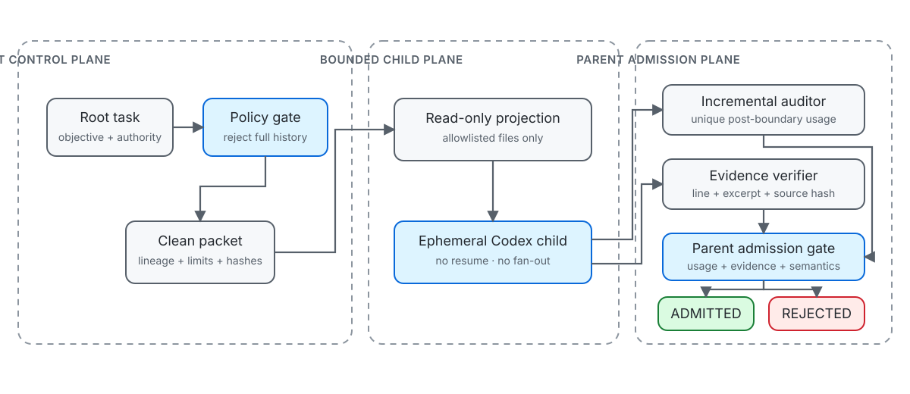

# Agent Floor v0.1 historical record

A Codex worker appeared to consume **555.3M tokens**.

Its verified request-local usage was **1,492,621 tokens**.

The **372× discrepancy** came from inherited cumulative history after `fork_turns="all"`. Agent Floor prevents this class of error before delegation and audits every worker afterward.

**Release gate:** AF-G0 PASS · **Version:** `v0.1.0-af-g0` · **Runtime:** Node.js 20+



## What Agent Floor is

Agent Floor is a zero-dependency Node.js control layer for governed Codex delegation. It turns a root task into a self-contained child packet, starts a fresh bounded Codex process, attributes only request-local usage, and admits a result only when the parent can verify its evidence and semantic contract.

Four layers remain separate:

| Layer | Responsibility |
|---|---|
| Policy controls | Declare allowed models, reasoning settings, context mode, authority, depth, concurrency, cycles, runtime, output, and token ceilings. |
| Mechanically enforced controls | Reject full-history inheritance, create a clean ephemeral process, disable child fan-out, project only allowlisted files, and terminate limit violations. |
| Telemetry interpretation | Deduplicate usage events and calculate post-boundary input, cached input, fresh input, output, and incremental totals. |
| Semantic evidence admission | Verify file, line, excerpt, source hash, finding code, status, required terms, and forbidden terms before admitting a result. |

## The failure it prevents

A cumulative counter can include work that existed before a child request. Treating that counter as the child total creates false attribution.

| Quantity | Tokens | Interpretation |
|---|---:|---|
| Raw cumulative counter | 555,300,000 | Inherited baseline plus child work |
| Request-local increment | 1,492,621 | Sixteen unique post-boundary request records |
| Overstatement removed | 553,807,379 | Raw counter minus verified child increment |
| Correction | 372.03× | Raw counter divided by verified child increment |

The sanitized regression preserves the measured request-local split: 1,380,352 cached input tokens, 103,132 fresh input tokens, and 9,137 output tokens. It adds a declared synthetic baseline solely to reproduce the 555.3M failure shape.

## How governed delegation works

1. Validate a root-owned task specification.
2. Reject any context mode other than `clean` and any `fork_turns` value other than `none`.
3. Build a canonical packet no larger than 8 KiB with lineage, authority, limits, source hashes, and output schema.
4. Copy only allowlisted regular files into a temporary read-only authority projection.
5. Start a new ephemeral Codex process with inherited rules, configuration, apps, plugins, memories, browser tools, computer tools, image tools, and multi-agent fan-out disabled. Pass only an explicit runtime environment allowlist and exclude common secret-bearing variable names from worker shells.
6. Monitor model/tool cycles, runtime, output bytes, and process status.
7. Audit only request-local JSONL usage or verified post-boundary legacy deltas.
8. Reopen the original sources and admit the result only if every deterministic evidence and semantic check passes.

The worker may recommend accepting or rejecting the target under review. That recommendation never controls whether the worker's own result is admitted; only the parent gate does.

## Architecture

The root-to-child boundary is one-way: the child receives a bounded packet and an allowlisted source projection, then returns schema-constrained output and request-local telemetry. It cannot resume the parent task or spawn another worker.

See [Architecture](docs/ARCHITECTURE.md), [Security model](docs/SECURITY-MODEL.md), [Threat model](docs/THREAT-MODEL.md), and [Privacy model](docs/PRIVACY.md).

## Quick start

```sh
git clone https://github.com/sntllgnc/agent-floor.git
cd agent-floor
npm ci
npm test
npm run demo
```

No package dependency is installed; `npm ci` verifies the frozen package metadata.

## Deterministic demonstration

`npm run demo` makes no model call. It evaluates the public sanitized fixture and writes reproducible detail records to the ignored `artifacts/generated/` directory.

Expected proof:

```text
14 tests passed
fork_turns="all" -> REJECTED
raw cumulative attribution -> 555,300,000
verified incremental usage -> 1,492,621
overstatement removed -> 553,807,379
correction -> 372.03x
evidence result -> ADMITTED
contradictory semantic control -> REJECTED
```

The frozen release record is [artifacts/af-g0.json](artifacts/af-g0.json).

## Native Codex execution

Validate the installed Codex surface without a model call:

```sh
npm run doctor
```

Run a governed child only when authenticated local Codex execution is intended:

```sh
node ./bin/agent-floor.js run ./examples/live-smoke-task.json --out ./artifacts/runs/native
```

The release's redacted native smoke used a clean GPT-5.6 Terra child at medium reasoning: one model call, two monitored cycles, 19,417 incremental tokens, and an admitted evidence record. No raw native event stream is published. See [artifacts/native-smoke-summary.json](artifacts/native-smoke-summary.json).

## Evidence admission

An evidence item is admitted only when:

- its repository-relative path was granted to the child;
- its one-based line exists;
- the exact excerpt occurs on that normalized line;
- the source still matches the packet-time SHA-256;
- the result satisfies parent-declared status, finding-code, required-term, forbidden-term, and evidence-count rules;
- execution succeeded within the declared bounds;
- measured incremental usage remains within the admission ceiling.

The fixture also includes a negative control that cites two real lines but reaches the opposite conclusion. Agent Floor rejects it. Real citations are necessary, not sufficient.

## AF-G0 verification

AF-G0 passes only when one command proves all of the following:

- clean context with zero inherited turns;
- mechanical rejection of full-history delegation;
- bounded model, reasoning, depth, concurrency, cycle, runtime, and output policy;
- request-local usage accounting with duplicate removal;
- reproduction of the 555.3M versus 1.49M attribution defect;
- deterministic evidence admission and semantic rejection;
- no dependency on a private repository.

Run `npm test`, `npm run demo`, `npm run public:audit`, and `npm run evidence:verify`. The release evidence inventory is [artifacts/evidence-manifest.json](artifacts/evidence-manifest.json).

## Security and privacy

Agent Floor executes locally. It does not upload raw logs, modify Codex credentials, or publish operator task history. The release contains only synthetic source files, sanitized telemetry-shaped fixtures, and a redacted native summary.

The child sees a temporary read-only projection instead of the original repository. The Codex process receives a small runtime environment allowlist instead of the complete parent environment; worker shells retain default filtering and add common key, secret, token, password, credential, and authentication name exclusions. The public package is scanned for local absolute paths, common credential formats, email addresses, session UUIDs, hidden metadata, raw logs, and private project names.

See [SECURITY.md](SECURITY.md) for vulnerability reporting and [Security model](docs/SECURITY-MODEL.md) for trust boundaries.

## Limitations and non-claims

Agent Floor verifies request-local telemetry attribution. It does **not** establish an account billing total, explain a provider quota decision, or assert that cached input is free. A token ceiling is enforced at admission after the completed request reports usage; it is not a pre-request provider-side spending cap.

AF-G0 is read-only. A later mutation phase must consume an admitted record under a separate explicit authority grant. See [Limitations](docs/LIMITATIONS.md).

## How Codex and GPT-5.6 were used

Codex implemented and verified the runner, accounting logic, fixtures, tests, evidence gate, documentation, and publication audit. GPT-5.6 Terra executed the redacted native smoke. The public deterministic demo and test suite do not require model access.

Agent Floor preserves the operator-selected root reasoning setting. Its policy accepts `minimal`, `low`, `medium`, `high`, `xhigh`, `ultra`, and `max`; the selected value is recorded rather than silently reduced. Model identifiers and reasoning tiers remain environment-dependent capabilities, not repository promises.

The runner is built around Codex non-interactive JSONL execution, ephemeral sessions, structured output, and configuration controls described in the official [non-interactive mode](https://learn.chatgpt.com/docs/non-interactive-mode), [subagent configuration](https://learn.chatgpt.com/docs/agent-configuration/subagents), and [configuration reference](https://learn.chatgpt.com/docs/config-file/config-reference).

## Codex adoption

Another Codex task can apply the policy without inheriting this repository's development history. Use the bounded instructions in [Codex adoption](docs/CODEX-ADOPTION.md).

## Build Week judge instructions

```sh
git clone https://github.com/sntllgnc/agent-floor.git
cd agent-floor
npm ci
npm test
npm run demo
```

The complete judge path, expected fields, and under-three-minute narration are in [Judge guide](docs/JUDGE-GUIDE.md). A separate fresh-task packet is available in [Independent Codex evaluation](CODEX_EVALUATION.md).

## Contributing and licence

Contributions are governed by [CONTRIBUTING.md](CONTRIBUTING.md), [CODE_OF_CONDUCT.md](CODE_OF_CONDUCT.md), and repository instructions in [AGENTS.md](AGENTS.md). Code, documentation, and sanitized fixtures are licensed under [Apache-2.0](LICENSE); [NOTICE](NOTICE) preserves attribution and the separate trademark boundary. Release evidence is summarized in [Release v0.1.0-af-g0](docs/RELEASE.md) and [CHANGELOG.md](CHANGELOG.md).
